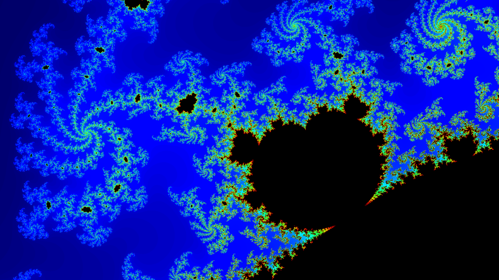

# Fractal Explorer

This subproject contains code to generate and visualize fractals, such as the Mandelbrot set. It includes a demo application that allows users to explore different regions of the fractal by zooming in and out and panning around.

## Features

Uses "jet" colormap for coloring the fractal based on iteration counts.

### Movement and Zooming

* Pan around the fractal using `WASD` keys.
* Zoom in and out using the `Q` and `E` keys.
* Save a screenshot using the `F` key.
* Change the iteration maximum using the `T` and `G` keys.

All the parameters are printed each render so locations can be revisited. This particular screen capture is at: `Generating fractal with 1920 x 1080 = 2073600 pixels, 296 iterations, x={-0.521889, -0.512303}, y={-0.104361, -0.098883}` with the Mandelbrot 3 choice.

### Command line options

* `--x-min <value>`: Minimum x-coordinate of the viewing window.
* `--x-max <value>`: Maximum x-coordinate of the viewing window.
* `--y-min <value>`: Minimum y-coordinate of the viewing window.
* `--y-max <value>`: Maximum y-coordinate of the viewing window.
* `--width <value>`: Width of the generated image in pixels.
* `--height <value>`: Height of the generated image in pixels.
* `--max-iterations <value>`: Maximum number of iterations for determining set membership.
* `--file <filename>`: Output filename for saving the generated fractal image.
* `--choice <value>`: Choice of fractal type (2 for Mandelbrot, 3 for Mandelbrot3).