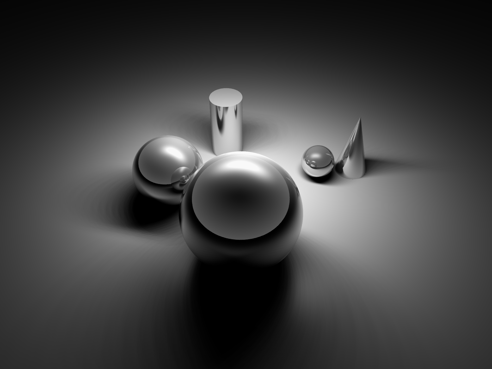

# C++17 Raytracer

This is a basic implementation of a raytracer in C++17 using my `linalg`, `noise` and `geometry` math libraries, and specifically using the `R3` namespace within geometry.

## Purpose

I made this library to understand the basics of raytracing and to utilize/exercise the subordinate math libraries. I have no intention of rivaling POVRay, Vivid3 or any other raytracer. This is more of a hobby project and partially an exploration of how to apply C++17 ideas to a raytracer as well. I would like to get to the point where I can trace a light source through a prism and get a rainbow. This will require several new features I don't have yet like dropping the `color` model and tracing photons of a specific frequency, then summing across frequencies through an LMS filter to reconstruct `color`. Then I'll be able to see chromatic aberration in concave lenses, neat diffraction patterns in thin-films and other effects.

## Features

The current feature set of the raytracer.

### Included

* Path Tracing `color` rays. We currently use the simplified `color` model. We don't trace per frequency, yet. That is the ultimate goal.
* A collection of "standard" objects. sphere, cuboids, cylinders, cones, toroids, generalized Quadratic shapes. Quadratic, Cubic and Quartic Solvers have been used to implement these.
* Some 1 sided planar objects (planes, rings, polygons, squares, etc)
* `overlap` objects which can be additive, subtractive, inclusive and exclusive.
* A collection of "standard" light types. Point, Parallel, "Spotlights".
* A new `bulb` type which has a multi-sampled surface.
* Medium mapping on surfaces which have mathematical mappings (spheres, cylinders, toroids, cuboids)

### Not Included

* Multi-path rendering, i.e. Monte Carlo methods.
* Bi-directional Scatter Functions (of any type).
* input OBJ/STL support

## Design

The overall design involves at the top level a `scene` in the world coordinates which contains:

* The list of `object`s
* The list of `light`s
* The `camera` (which has the `image`)

When colliding a cast ray in to the scene, a check is made to determine if the point has an unobstructed path to each light in the scene. This allows all the sources to blend together at the surface. Reflectance is also started at this point and continues back into the scene recursively for a set number of bounces. In the future, refraction will also happen at this point onwards through transparent material.

### _Note_

The math uses the "right hand" coordinate system.

### `entity`

Entities are the basic primitive in the raytracer. Everything is an entity, except the `scene`. The class is a template. An entity has:

1. Position (Translation)
1. Orientation (Rotation)
1. Scale (largely unused in this implementation due to complicating factors).

While a `camera` is an entity and logically has all of these properties, they are derived from different, camera specific attributes, except position.

### `object`

Objects in the `raytrace` are an `entity` that have several additional properties. The class is a templated mixin.

1. Material properties (as in a `medium`)
1. Normals returned as a world `R3::vector` given a world `R3::point`.
1. Intersection determination.
1. Declarations on the number of total intersections possible and if the surface is closed or not.

### Types of `object`s

Here's the list of objects supported by the raytracer, how you define them and generally how it's solved. Each type of object provides an intersection method (with a ray), a medium mapping function and a normal generator.

#### Plane

A flat infinite plane.

* Inherits from: `object`
* Defined by: A point and a normal
* Solved By: Simple math

#### Triangle

3 coplanar points

* Inherits from: `plane`
* Defined by: 3 points
* Solved By: `plane` first, then 3 point curl exclusion

#### Ring

A flat circular disc like a planetary ring.

* Inherits from: `plane`
* Defined by: A point and a two radii
* Solved By: `plane` first, then 2 polar coordinate checks.

#### Square

A flat square upon a plane.

* Inherits from: `plane`
* Defined by: A point and a normal, and two half-widths.
* Solved By: `plane` first then cartesian containment.

#### Sphere

The standard sphere.

* Inherits from: `object`
* Defined by: A point and a radius. The point is in the center.
* Solved By: Quadratic Solver

#### Cuboid

The standard cuboidal shape

* Inherits from: `object`
* Defined by: A point and three half-width. The point is in the center.
* Solved By: Modified AABB

#### Cylinder

The standard cylinder with a height cut off.

* Inherits from: `object`
* Defined by: A point (at center), a half-height and a radius.
* Solved By: Quadratic Solver
* _Note_: Not a closed surface. Cap not included.

#### Cone

The standard (one sided) cone.

* Inherits from: `object`
* Defined by: A point (at base) a height, and a radius.
* Solved By: Cubic Solver
* _Note_: Not a closed surface. Cap not included.

#### Torus

The standard donut.

* Inherits from: `object`
* Defined by: A point (at center) and two radii.
* Solved By: Quartic Solver (4th order)

#### Quadratic Surface

A generalized quadratic surface.

* Inherits from: `object`
* Defined by: A point (at center) and a `matrix` which defines the normals and surface.
* Solved By: Quadratic Solver
* _Note_: May not be a closed surface?
* _See_: Graphics Gems 3rd Ed for examples.

#### Pyramid

A "rotated" pyramid. Fixed slope of 45 degrees.

* Inherits from: `object`
* Defined by: A point (at base) and a height.
* Solved By: Custom Solver for `z = height - |x| - |y|`.
* _Note_: Not a closed surface. Cap is not included.

#### Overlaps

There are four types of overlaps in the `raytrace`. In each cases it is a set of 2 objects A and B (which themselves could be nested overlaps).

##### Additive

In this form, it is just like with two separate objects sharing the same material definition. Any internally overlapping regions are ignored.

##### Subtractive

In this form, there is a base object A and a subtracted object B. All of B's normals become negated. When B's intersected points come first in the search we skip until the last B point is used.

##### Inclusive

An inclusive overlap is then only the part contained between both objects is kept. When the hit list has alternating A and B, then you return the inner set.

##### Exclusive

An exclusive overlap is then responds by removing the overlapping parts. Looks similar to additive, but the overlapping inner parts are gone.

### `medium`

The material (or lack thereof) in which rays pass. The `vacuum` is a medium, as is glass or rubber. Some mediums are opaque and diffuse while others are shiny. The ray trace is started in a medium. You could trace from the inside of a non transparent medium, which would be largely pointless.

Some attributes:

* Mediums can cause dropoff in the intensity of light due to effects like Beer's Law.
  * _This emulates haze or a semi-transparent medium_.
* Mediums take volumetric coordinates.
* Mediums can be _mapped_ to 2D coordinates for flat surfaces (like planes)

#### surfaces

The boundary or interface between two mediums is referred to as a surface (although it has no formal object representation). Surfaces are the points where the raytracer stops to determine what to do next.

Medium's attribute calls take volumetric coordinates (xyz space).

#### Object Hierarchy

The raytrace library currently supports this object hierarchy for mediums.

* `medium`
  * `conductor` - Nearly all light is reflected, very low transmitted.
    * `metal`
      * `chrome`, `steel`, `copper`, `silver`, etc
* `dielectric`
  * `opaque` - majority reflected light, but diffuse coloring and can have specular highlights
    * `plain` - no specular highlights, or at least _super_ rough
    * `dots` - a plain dotted pattern
    * `checkerboard` - common shiny floor in raytracing
    * perlin noise patterns like `marble`
  * `transparent` - majority transmitted light, some reflected (2%)
    * `glass`
    * `air`
    * `vacuum` - The most basic medium (which has no substance)

### `light`

There are several types of `light` which all have the same interface.

* The intensity of a color at a given point - The interface should compute the distance to the point from the light and use the drop off curve (of it's type) to determine the intensity.
* For a directional light, only the inverse of the incoming direction is checked for a collision. For a point light, the vector to the point is checked. In both cases, rays are cast from the surface to the supposed location of the light, so the interface must check for collisions along a ray (or give a ray to check for collisions along).

#### `speck`

These are basically just point lights with no volume. Uses the inverse square law for falloff.

#### `beam`

These are directional lights at very large distances. All light rays are parallel and have no falloff.

#### `spot`

These are a specialization of a `speck` light where an angle to the incoming ray is checked. Light only is transmitted along a ray if under the threshold angle.

#### `bulb`

Defined with the number of samples points on the surface of the light. It is assumed the "light surface" is transparent and does not block itself. Each sample is then mapped into a volumetric point for the source point.

### `camera`

A raytracing camera typically has a few interesting attributes which users can specify

1. The width and height of the image plane in Pixels. `raytrace` uses an `RGB8` format.
1. Horizontal Field of View. This is the angle across the image plane. Since we assume pixels are square, the same angular size of pixel applies horizontally and vertically, so you only need to specify one. Most cameras in real life have an angle around `55` to `70` degrees. Technically you can go all the way up to (but not including `180`).
1. The `from` position and the `to` position in 3D space. `from` is where the camera "eye" is in most traditional descriptions of cameras. The `to` is where the principal point of the image plane is (the center of the image plane). _Determining the distance from the camera eye to the image plane determines the most important thing for the camera, SCALE._ You could have a "camera" the size of a galaxy or the size of an atom in a raytracer. The math is all the same. The

These are used to fill in the intrinsics and the projection matrix.

## Optimization

This is also a useful project to understand how to optimize with SSE2/AVX as well.

* `color` is now leveraging `__AVX2__`.

## Additional Ease of Use Features

* Predefined `color` objects in the `colors` namespace. i.e.`colors::magenta`
* Predefined `medium` feature values like `smoothness::polished` for surface reflectivity. See medium.hpp.
* Predefined geometry basics like `R3::basis` vectors for `X`, `Y`, and `Z` and `R3::origin`.

## Design Assumptions

* When computing a collision with a ray on a surface and the point of the ray is _on_ the surface, there are two situations.
  * The ray points into the surface - this is a collision (`dot(R,N) < 0`)
  * The ray points away (or tangent) from the surface - this is not a collision (`dot(R, N) > -basal::epsilon`)

## Todos

* TODO Shadow Rays traced through transparent objects
* TODO implement diffraction (a special case of which is refraction and reflection)
* TODO Polygon (N polygons or does the polygon cross trick work for more than 3 points (as long as it is convex and coplanar?)
* TODO Cap the end of cylinders so they can be used in `overlap`s. Does that mean the cap has to be in the equation so they can be used in `overlaps`?
* TODO Create a world of a grid of spheres with different roughnesses to demonstrate the values.
* TODO Create a world of a grid of spheres with different phong value to demonstrate the values.

## References

### Links

* [3D Computer Graphics](http://www.math.ucsd.edu/~sbuss/MathCG2/)
* [Raytracing](https://www.cl.cam.ac.uk/teaching/1999/AGraphHCI/SMAG/node2.html)
* [Raytracing Class](https://www.rose-hulman.edu/class/cs/csse451/)
* [Raytracing Topics (Short)](https://www.flipcode.com/archives/Raytracing_Topics_Techniques-Part_1_Introduction.shtml)
* [Path Tracing](https://blog.demofox.org/2016/09/21/path-tracing-getting-started-with-diffuse-and-emissive/)
* [All of Optics is Scattering](https://www.youtube.com/watch?v=mv_90PC5XKw)
* [Why does Light REALLY Bend?](https://www.youtube.com/watch?v=cep6eECGtw4)
* [Why aren't Mirrors White? Why isn't EVERYTHING a Mirror?](https://www.youtube.com/watch?v=1n_otIs6z6E)
* [Bidirection Reflectance Distribution Function](https://www.youtube.com/watch?v=ytRrjf9OPHg)
* [ShaderToy: Global Illumination](https://www.shadertoy.com/view/MsdGzl)
* [Stephen H. Westin's Site, a little bit of everything](http://www.graphics.cornell.edu/~westin/)

### Reference Material

* [AVX Lib](http://software-lisc.fbk.eu/avx_mathfun/)
* [Intel Intrinsics](https://software.intel.com/sites/landingpage/IntrinsicsGuide/#)
* [Cross/Dot Product](https://geometrian.com/programming/tutorials/cross-product/index.php)
* [Refractive Index Database](http://refractiveindex.info)
* [Appearance Modelling](http://www.cs.cmu.edu/afs/cs/academic/class/16823-s16/www/pdfs/)
* [Interactive Abbe Diagram](https://www.us.schott.com/advanced_optics/english/knowledge-center/technical-articles-and-tools/abbe-diagramm.html)
* [Bidirectional scattering distribution function (BSDF)](ttps://support.lumerical.com/hc/en-us/articles/360042213854-Bidirectional-scattering-distribution-function-BSDF-)
* [Disk Point Picking](https://mathworld.wolfram.com/DiskPointPicking.html)
* [Permeability](https://www.engineeringtoolbox.com/permeability-d_1923.html)
* [Permittivity](https://www.engineeringtoolbox.com/relative-permittivity-d_1660.html)
* [Resistance](http://hyperphysics.phy-astr.gsu.edu/hbase/Tables/rstiv.html)
* [Resistance and Conductivity](https://www.engineeringtoolbox.com/resistivity-conductivity-d_418.html)

### PDFs and Slides

* [Reflectance and Transmission](https://www.flipcode.com/archives/reflection_transmission.pdf)
* [Global Illumination using Photon Maps](http://graphics.ucsd.edu/~henrik/papers/ewr7/global_illumination_using_photon_maps_egwr96.pdf)
* [MIT 6.837 Ray Tracing](https://ocw.mit.edu/courses/electrical-engineering-and-computer-science/6-837-computer-graphics-fall-2012/lecture-notes/MIT6_837F12_Lec13.pdf)
* [Brown: Reflection and Refraction of Materials](https://www.brown.edu/research/labs/mittleman/sites/brown.edu.research.labs.mittleman/files/uploads/lecture09and10.pdf)

#### Research

* [Reflection, transmission and scattering Direction-resolved measurement of transmission and reflection](https://www.hslu.ch/en/lucerne-school-of-engineering-architecture/research/competence-centers/gebaeudehuelleundingenieurbau/gebaeudehuelle/envelopes-and-solar-energy/labore-und-infrastruktur/reflektion-transmission-und-streuung/)

### Similar Examples

* [Perlin Noise Generator](http://lencinhaus.github.io/canvas-noise/)
* [A Spectral Raytracer](http://people.eecs.berkeley.edu/~cecilia77/graphics/a6/)
* [Jacco Bikker's Raytracer](https://www.flipcode.com/archives/Raytracing_Topics_Techniques-Part_1_Introduction.shtml)

### Wikipedia Pages

* <https://en.wikipedia.org/wiki/Luminous_intensity>
* <https://en.wikipedia.org/wiki/Reflectance>
* <https://en.wikipedia.org/wiki/Luminance>
* <https://en.wikipedia.org/wiki/Etendue>
* <https://en.wikipedia.org/wiki/Lambertian_reflectance>
* <https://en.wikipedia.org/wiki/Fresnel_equations>
* <https://en.wikipedia.org/wiki/Geometrical_optics>
* <https://en.wikipedia.org/wiki/Ray_tracing_(physics)>
* <https://en.wikipedia.org/wiki/Ray_tracing_(graphics)>
* <https://en.wikipedia.org/wiki/Rendering_equation>
* <https://en.wikipedia.org/wiki/Transparency_and_translucency>
